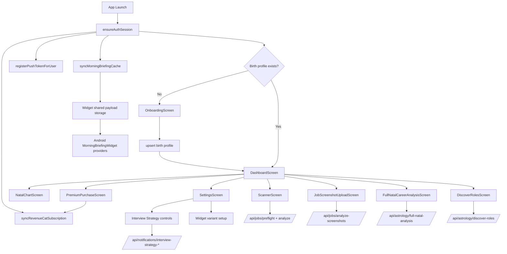

# Project: Horojob Mobile (USA Market Focus)
**Version:** 1.4 (synced on 2026-04-07)  
**Status:** Active (mobile app in production-oriented state, selected roadmap items still pending)

---

## 0. Repo Topology and DB Access
- Mobile client (this repo): `horojob/`
- Backend API: `../horojob-server`
- MongoDB access is configured in backend `.env`

---

## 1. Core Vision
Career intelligence app that combines astrology signals with AI-oriented career interpretation, daily ritual loops, and premium productivity tooling.

---

## 2. Technical Stack
- **Frontend:** React Native + Expo (Android and iOS app targets; native widget implementation is Android-first)
- **Styling:** NativeWind + custom token/theme layer in `src/theme`
- **Environment:** `EXPO_PUBLIC_APP_ENV=development|staging|production` controls technical UI, QA/debug surfaces, and development-only overrides
- **Data layer:** service modules + TanStack Query hooks for AI-heavy flows (incremental rollout)
- **Runtime contract validation:** Zod schemas for AI, career-analysis, and job-analysis payloads
- **Navigation:** React Navigation native stack
- **Backend/DB:** Node + MongoDB (`../horojob-server`)
- **Astrology APIs:** server-owned astrology endpoints consumed by mobile
- **Notifications:** Expo Notifications + app-side push token sync
- **Payments:** RevenueCat SDK + backend sync bridge
- **Widgets:** Android native widget providers + shared briefing payload bridge (iOS widget extension pending)

---

## 3. Key Feature Architecture

### A. Core Tools
1. **Onboarding + Natal Profile:** date/time/city input with profile persistence and server sync.
2. **Scanner + Job Position Check:** URL preflight/analyze, screenshot analyze flow, premium gate and usage-limit UX.
3. **AI Synergy and Daily Transit:** dashboard insights + stored history integration.
4. **Full Natal Career Analysis:** dedicated report screen with refresh/regenerate flow.
5. **Discover Roles:** recommendation/search flow from backend role catalog.

### B. Retention & Habit Loop
1. **Morning Career Briefing:** daily payload sync to app and widget bridge.
2. **Burnout Alert System:** mobile settings + plan integration in place; full delivery pipeline still evolving.
3. **Lunar Productivity:** mobile settings + dashboard card + backend scheduler/dispatch pipeline are in place; pushes and dashboard visibility now follow the same extreme supportive/disruptive lunar bands and are framed as action-ready guidance for the current workday, while deeper timing UX is still being refined.
4. **Interview Strategy:** server-authoritative planning + calendar sync + settings controls.
5. **Home Screen Widgets:** Android multi-variant providers (light/dark aware), in-app variant picker.

### C. Not Delivered Yet
1. **Game loop** (product definition pending)
2. **iOS native widget extension**

### D. Cross-Cutting Client Data Layer
1. `App.tsx` now mounts a global `QueryClientProvider` from `src/lib/queryClient.ts`.
   - default query policy: `5m` stale, `30m` GC, `2` retries, reconnect refetch enabled
   - features can still override those values per hook for heavier AI endpoints
2. `src/services/aiOrchestration.ts` is the shared mobile entry point for AI request helpers.
   - available helpers: retry, timeout, fallback, cache-hit/cache-miss tracking
   - current hook adoption uses retry plus cache metrics; timeout/fallback helpers exist but are not yet wired into active screen flows
3. `src/services/aiTelemetry.ts` is the shared observability adapter for AI requests.
   - current state: non-production console logging for request/success/error/fallback/cache events
   - future sink point: Sentry/LogRocket/custom analytics, not yet connected in production
4. `src/schemas/aiSynergySchema.ts`, `src/schemas/careerAnalysisSchema.ts`, and `src/schemas/jobAnalysisSchema.ts` now own runtime validation and inferred mobile types for the main AI-backed payloads.
5. Adoption status is partial by design.
   - `AiSynergyTile` already reads through a React Query hook
   - career-analysis and job-analysis hooks exist, but `FullNatalCareerAnalysisScreen`, `DeepDiveTile`, `useScannerRuntime`, and `useJobScreenshotUploadRuntime` still use the existing direct service/runtime path today
6. Preferred extension pattern for new AI-backed mobile features:
   - keep transport in `src/services/*`
   - define runtime schema in `src/schemas/*`
   - wrap request orchestration in a dedicated hook under `src/hooks/queries/*`
   - use `aiOrchestrator` for retry/telemetry boundaries
   - keep screens/components consuming typed hook output instead of raw transport payloads
7. Current performance boundaries:
   - `AiSynergyTile`, `JobCheckTile`, and `DeepDiveTile` are memoized to reduce unnecessary dashboard re-renders
   - shared onboarding SVG backgrounds are memoized because the same heavy art is reused across startup and onboarding, while the light variant stays parked for a future v2 rollout

---

## 4. UI/UX Direction
- Dark-first mobile app runtime for v1, with tokenized light-theme assets preserved for v2
- Glass and aura visual language for premium blocks
- Dashboard-first layout with modular insight tiles
- Mobile-first interaction model with explicit premium-gated paths
- Android widgets remain light/dark aware in native day/night resources

---

## 5. Monetization Model
- **Free:** limited scans, baseline insights
- **Premium:** 10 successful job checks per UTC day, strategy modules, widget setup, Full Career Blueprint, and deeper AI work guidance
- Gating remains anchored on backend `subscriptionTier` projection for compatibility
- Trial is not part of the current release scope; revisit partial/full trial design after the premium feature set is less uneven.

---

## 6. Implementation Roadmap (Current Snapshot)

### Phase 1: Foundation & Core Mobile UI
- [x] React Native/Expo project and navigation foundation
- [x] Onboarding + dashboard + scanner + settings + premium + natal analysis screens
- [x] Service-layer architecture for API + local storage
- [x] Dark-first themed design system for the mobile app, with app light theme deferred to v2

### Phase 2: Session, Sync, and Platform Integration
- [x] Session bootstrap and per-user onboarding/profile cache syncing
- [x] Push token registration and app-side notification response handling
- [x] Android widget bridge/provider implementation
- [ ] iOS native widget extension

### Phase 3: Career Intelligence Features
- [x] Job position check orchestration and scanner flow
- [x] Daily transit + AI synergy integration
- [x] Full natal career analysis screen + API wiring
- [x] Discover roles API and UI integration
- [x] Interview strategy settings + backend plan + calendar sync
- [ ] Burnout alert full delivery pipeline completion
- [ ] Lunar productivity timing/status UX hardening

### Phase 4: Billing and Release
- [x] RevenueCat mobile integration and backend sync usage in app startup/paywall
- [x] Premium paywall wiring and restore/sync behavior in app flows
- [ ] App store release assets and submission operations
- [ ] Full release certification pass across both platforms

---

## 7. Architecture Diagram (Current)

---

## 8. Focused Behavior Addenda
- Notification routing and alert entry points:
  - `docs/notification-routing-and-alert-entrypoints.md`
- Dashboard insight card runtime behavior:
  - `docs/dashboard-insight-cards-behavior.md`
- Scanner micro-UX and cache/fallback behavior:
  - `docs/scanner-flow-ux-addendum.md`
