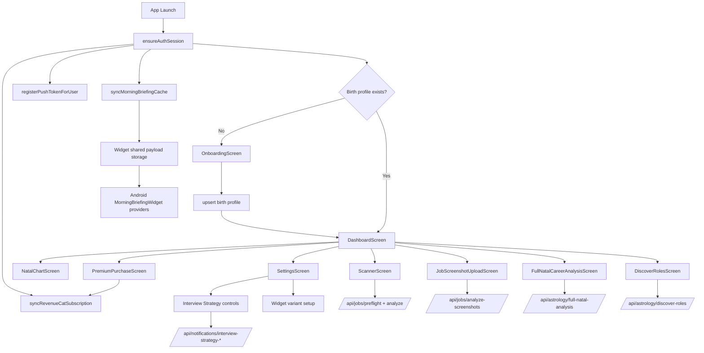

# Project: Horojob Mobile (USA Market Focus)
**Version:** 1.7 (synced on 2026-04-25)
**Status:** Active (mobile app in production-oriented state, selected roadmap items still pending)

---

## 0. Repo Topology and DB Access
- Mobile client (this repo): `horojob/`
- Backend API: `../horojob-server`
- Public website / landing + public market surface: `../horojob-landing`
- MongoDB access is configured in backend `.env`
- The first public release has not shipped yet and production DB starts empty. Until that release, prefer clean current contracts over compatibility shims for old payloads, old indexes, or local development data.
- Documentation linkage rule for public-market work:
  - when CareerOneStop/O*NET compliance interpretation, attribution treatment, or public tool scope changes, update docs in `horojob`, `horojob-server`, and `horojob-landing` together;
  - `horojob-landing` is now a first-class repo in the product topology and must not stay undocumented relative to mobile/backend decisions.

---

## 1. Core Vision
Career intelligence app for the U.S. market that combines reliable labor-market data, astrology/profile signals, AI-oriented career interpretation, daily ritual loops, and premium productivity tooling.

Product direction: market facts should be available as free/public utility where required by provider terms; premium value should come from personalized synthesis, prioritization, timing, saved workflows, and decision support.

---

## 2. Technical Stack
- **Frontend:** React Native + Expo (Android and iOS app targets; native widget implementation is Android-first)
- **Styling:** NativeWind + custom token/theme layer in `src/theme`
- **Environment:** `EXPO_PUBLIC_APP_ENV=development|staging|production` controls technical UI, QA/debug surfaces, and development-only overrides
- **Data layer:** service modules + TanStack Query hooks for AI-heavy flows (incremental rollout)
- **Runtime contract validation:** Zod schemas for AI, career-analysis, and job-analysis payloads
- **Navigation:** React Navigation native stack
- **Backend/DB:** Node + MongoDB (`../horojob-server`)
- **Astrology APIs:** server-owned astrology endpoints consumed by mobile
- **Labor-market APIs:** server-owned integrations for U.S. market data (CareerOneStop and O*NET credentials configured in backend; provider smoke checks pass from a U.S. VPN path)
- **Notifications:** Expo Notifications + app-side push token sync
- **Payments:** RevenueCat SDK + backend sync bridge
- **Widgets:** Android native widget providers + shared briefing payload bridge (iOS widget extension pending)

---

## 3. Key Feature Architecture

### A. Core Tools
1. **Onboarding + Natal Profile:** date/time/city input with profile persistence and server sync.
2. **Scanner + Job Position Check:** URL preflight/analyze, screenshot analyze flow, premium gate and usage-limit UX.
3. **AI Synergy and Daily Transit:** dashboard insights + stored history integration.
4. **Full Natal Career Analysis:** dedicated one-shot report screen; no user-facing regenerate flow.
5. **Discover Roles:** recommendation/search flow from backend role catalog, with planned expansion toward role reality, transition guidance, compare, and optional current-job personalization.
6. **Market-Driven Career Intelligence:** labor-market enrichment for salary ranges, outlook, demand, skills, pay transparency, role-market fit, and negotiation support. Job Position Check, Discover Roles, Natal Chart market paths, Negotiation Prep card/page, and Full Career Blueprint now share provider-backed market context.

### B. Retention & Habit Loop
1. **Morning Career Briefing:** daily payload sync to app and widget bridge.
2. **Burnout Alert System:** mobile settings + plan integration in place; full delivery pipeline still evolving.
3. **Lunar Productivity:** mobile settings + dashboard card + backend scheduler/dispatch pipeline are in place; pushes and dashboard visibility now follow the same extreme supportive/disruptive lunar bands and are framed as action-ready guidance for the current workday, while deeper timing UX is still being refined.
4. **Interview Strategy:** server-authoritative planning + calendar sync + settings controls.
5. **Home Screen Widgets:** Android multi-variant providers (light/dark aware), in-app variant picker.

### C. Not Delivered Yet
1. **Game loop** (product definition pending)
2. **iOS native widget extension**

### D. Cross-Cutting Client Data Layer
1. `App.tsx` now mounts a global `QueryClientProvider` from `src/lib/queryClient.ts`.
   - default query policy: `5m` stale, `30m` GC, `2` retries, reconnect refetch enabled
   - features can still override those values per hook for heavier AI endpoints
2. `src/services/aiOrchestration.ts` is the shared mobile entry point for AI request helpers.
   - available helpers: retry, timeout, cache-hit/cache-miss tracking
   - current hook adoption uses retry plus cache metrics; timeout helper exists but is not yet wired into active screen flows
3. `src/services/aiTelemetry.ts` is the shared observability adapter for AI requests.
   - current state: non-production console logging for request/success/error/cache events
   - future sink point: Sentry/LogRocket/custom analytics, not yet connected in production
4. `src/schemas/aiSynergySchema.ts`, `src/schemas/careerAnalysisSchema.ts`, and `src/schemas/jobAnalysisSchema.ts` now own runtime validation and inferred mobile types for the main AI-backed payloads.
5. Adoption status is partial by design.
   - `AiSynergyTile` already reads through a React Query hook
   - `useScannerRuntime` and `useJobScreenshotUploadRuntime` now read through the job-analysis query mutations
   - `FullNatalCareerAnalysisScreen` and `DeepDiveTile` still use the existing direct service/runtime path today
6. Preferred extension pattern for new AI-backed mobile features:
   - keep transport in `src/services/*`
   - define runtime schema in `src/schemas/*`
   - wrap request orchestration in a dedicated hook under `src/hooks/queries/*`
   - use `aiOrchestrator` for retry/telemetry boundaries
   - keep screens/components consuming typed hook output instead of raw transport payloads
7. AI guidance safety policy:
   - guidance must be framed as reflective career coaching, not guaranteed prediction
   - recommendations should stay practical and specific without promising certain outcomes
   - LLM prompts for career-guidance features must include this framing
   - LLM failures must not be hidden behind fabricated template reports; the app should show a human-readable error or use a real provider fallback when that provider abstraction exists
8. User-facing copy policy:
   - every text visible in production must be written for users, not for engineers
   - technical labels, model names, provider names, prompt versions, and raw system codes may appear only behind the development/QA technical-surface flag
   - loader steps should describe what the user can understand is happening without naming internal vendors or implementation details
9. AI source/provider disclosure policy:
   - production UI should not show report source, model, or provider by default
   - development builds may expose source/model/prompt metadata for QA
   - if legal review identifies a jurisdictional AI-use disclosure requirement, satisfy it with a clear general product-level/user-level notice rather than exposing provider/model internals in every report
10. Labor-market source attribution policy:
   - market-data source attribution must be visible wherever provider-backed market facts appear
   - CareerOneStop-backed market facts must show the CareerOneStop logo/icon in the same footer row as the attribution copy
   - provider attribution must not be attached to Horojob's astrology/profile recommendations
   - copy must not imply CareerOneStop, O*NET, or any public data provider endorses Horojob guidance, astrology interpretation, or fit scoring
   - market-data blocks and Horojob interpretation blocks must stay visually and semantically distinct
   - provider clarification recorded on April 25, 2026: one public website/tool is sufficient for CareerOneStop Web API compliance; the same data may also appear inside the mobile app, including login-gated screens, as long as the public free no-login website version exists
   - the website compliance surface now ships from `../horojob-landing` at `app/market-tools/role-outlook/page.tsx`
   - the public web tool reads normalized provider facts from `../horojob-server` via `GET /api/public/market/occupation-insight`
11. Current performance boundaries:
   - `AiSynergyTile`, `JobCheckTile`, and `DeepDiveTile` are memoized to reduce unnecessary dashboard re-renders
   - shared onboarding SVG backgrounds are memoized because the same heavy art is reused across startup and onboarding, while the light variant stays parked for a future v2 rollout

---

## 4. UI/UX Direction
- Dark-first mobile app runtime for v1, with tokenized light-theme assets preserved for v2
- Glass and aura visual language for premium blocks
- Dashboard-first layout with modular insight tiles
- Mobile-first interaction model with explicit premium-gated paths
- Android widgets remain light/dark aware in native day/night resources

---

## 5. Monetization Model
- **Free:** baseline insights, free/public labor-market facts where required by data-source terms, 30 Lite job checks per day, 1 Full job analysis per day, and scan history.
- **Premium:** 30 Lite job checks per day, 10 Full job analyses per day, deeper personalized synthesis, strategy modules, widget setup, Full Career Blueprint, saved/compare workflows, negotiation support, timing/calendar guidance, and deeper AI work guidance.
- Gating remains anchored on backend `subscriptionTier` projection for compatibility
- Trial is not part of the current release scope; revisit partial/full trial design after the premium feature set is less uneven.
- Market-data monetization boundary: do not sell raw public provider facts as the premium value; sell value-added personalized decisions and workflows built on top of them.

---

## 6. Implementation Roadmap (Current Snapshot)

### Phase 1: Foundation & Core Mobile UI
- [x] React Native/Expo project and navigation foundation
- [x] Onboarding + dashboard + scanner + settings + premium + natal analysis screens
- [x] Service-layer architecture for API + local storage
- [x] Dark-first themed design system for the mobile app, with app light theme deferred to v2

### Phase 2: Session, Sync, and Platform Integration
- [x] Session bootstrap and per-user onboarding/profile cache syncing
- [x] Push token registration and app-side notification response handling
- [x] Android widget bridge/provider implementation
- [ ] iOS native widget extension

### Phase 3: Career Intelligence Features
- [x] Job position check orchestration and scanner flow
- [x] Daily transit + AI synergy integration
- [x] Full natal career analysis screen + API wiring
- [x] Discover roles API and UI integration
- [x] Interview strategy settings + backend plan + calendar sync
- [x] Market-data enrichment for Job Posting Check Lite/Full scanner slice
- [x] Market-data enrichment for Discover Roles recommendation slice
- [x] Market-data enrichment for Natal Chart, Negotiation Prep, and Full Career Blueprint market paths
- [ ] Discover Roles expansion: `current job` (now edited from `Settings -> Birth Details`), sectioned role detail, decision support, and inline compare are now implemented; remaining work is mainly catalog/search quality and related polish. This personalization must not depend on scanner history or saved scans.
- [ ] Burnout alert full delivery pipeline completion
- [ ] Lunar productivity timing/status UX hardening

### Phase 4: Billing and Release
- [x] RevenueCat mobile integration and backend sync usage in app startup/paywall
- [x] Premium paywall wiring and restore/sync behavior in app flows
- [ ] App store release assets and submission operations
- [ ] Full release certification pass across both platforms

---

## 7. Architecture Diagram (Current)

---

## 8. Focused Behavior Addenda
- Notification routing and alert entry points:
  - `docs/notification-routing-and-alert-entrypoints.md`
- Dashboard insight card runtime behavior:
  - `docs/dashboard-insight-cards-behavior.md`
- Scanner micro-UX and cache/fallback behavior:
  - `docs/scanner-flow-ux-addendum.md`
- Market-driven career intelligence plan:
  - `docs/market-driven-career-intelligence-plan.md`
- Market-driven technical implementation plan:
  - `docs/market-driven-technical-implementation-plan.md`
- Public web market surface plan (`horojob-landing`):
  - `docs/public-web-market-surface-plan.md`
- Discover Roles expansion plan:
  - `docs/discover-roles-expansion-plan.md`
- Discover Roles single-screen UX plan:
  - `docs/discover-roles-single-screen-ux-plan.md`
